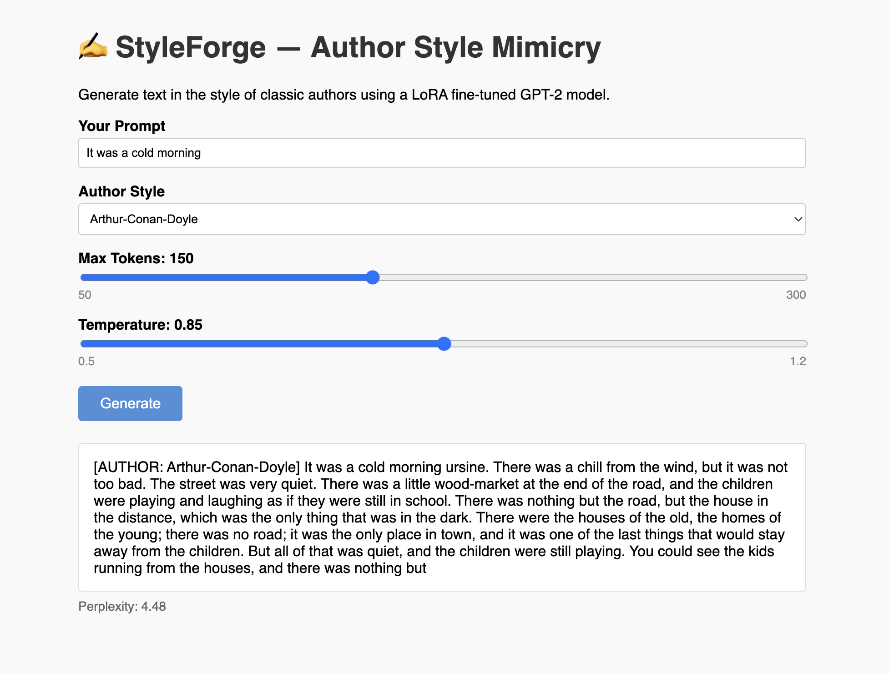
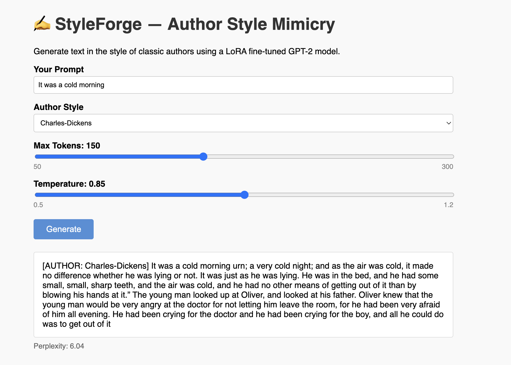
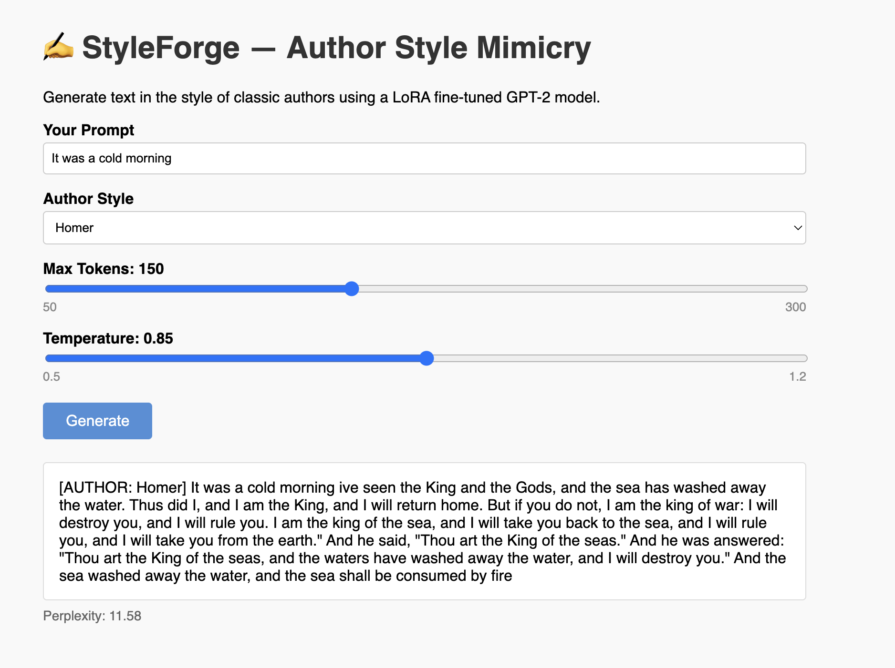
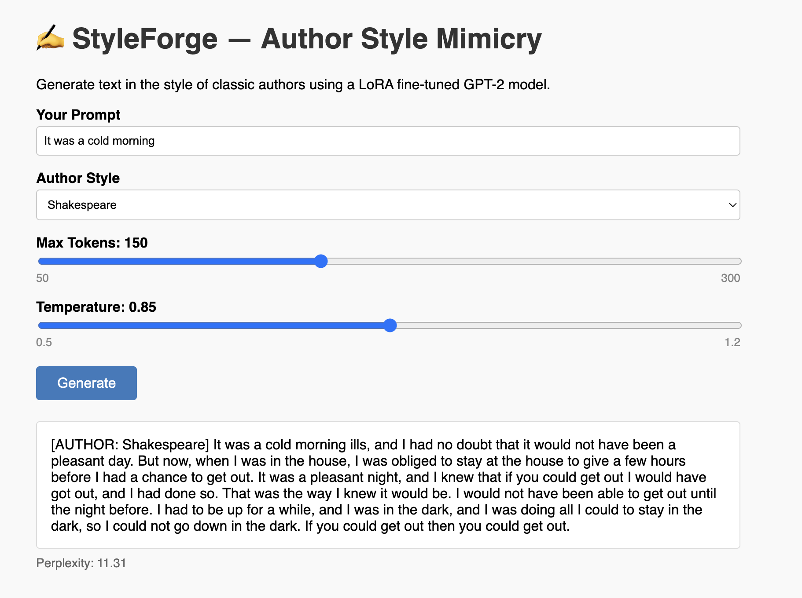

# 📖 StyleForge
This repository contains code for a Fine Tuned AI Model that mimics the writing style of Authors.

  
    

# 👀 Overview
This project aims to fine tune a pre-existing LLM, in order to create an application where users can get text generated
in the style of the author, given a prompt.

For this project the base `gpt2` model from [HuggingFace](https://huggingface.co/) has been used. This is the smallest variant in the GPT-2 family with ~117M parameters.
This model was chosen because this project has been trained locally on a MacBook, running an M4 Apple Silicon Chip. This model has been trained
using **LoRA (Low-Rank Adaptation)**, a parameter-efficient fine-tuning (PEFT) technique.

The code here can be used with better hardware and larger models, a combination that would likely yield better results.

In addition the following technologies are being used for this project:
- [**Python**](https://www.python.org/)
- [**PyTorch**](https://pytorch.org/)
- [**Accelerate**](https://developer.apple.com/documentation/accelerate)
- [**Flask**](https://flask.palletsprojects.com/en/stable/)

# 🛠️ Setup
In order to setup and run this project, a Python Runtime Environment is necessary. All dependencies are listed in the `requirements.txt` file and can 
be installed using any Python Package Manager such as **pip**.

# 🥊 Training
There are 4 steps involved in training and fine-tuning in this project:

- **Preparing Data**: This step involves collecting data to be used and cleaning/chunking it. For this initial setup data has been collected from [Project Gutenberg](https://www.gutenberg.org/) on the following authors: Arthur Conan Doyle, Homer, Shakespeare, and Charles Dickens. This can be found in the `data/raw` section. This step involves running 
the `prepare_data.py` script which prepares the data so that the model can be trained.

- **Creating Dataset**: This step involves creating training and validation sets from our cleaned data. This can be accomplished by running the
`create_dataset.py` script.

- **Training the Model**: In this step the model is trained using the prepared dataset. Can be accomplished by running the `main.py` script

- **Evalution**: In this step the performance of the trained model is evaluated across authors via a sample prompt. This step is performed by running the `evaluate.py` script.

# 💻 Sample Usage
After training, a **Flask app** can be used to interact with the trained model. This is accomplised by running the `app.py` script.
Below are sample images of the application.

  
    

  
    

  
    

  
    

# 🍴 Forking & Contribution
Forking, Contributions and feedback are more than welcomed. 

When forking and/or contributing to this project , please do pay attention to: [LICENSE](./LICENSE)

☕☕☕**CHEERS AND THANK YOU**☕☕☕
